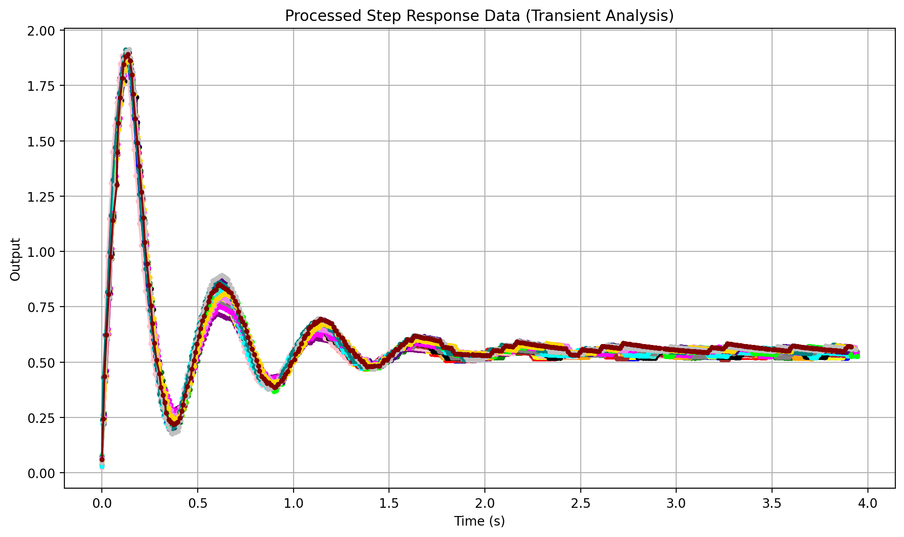
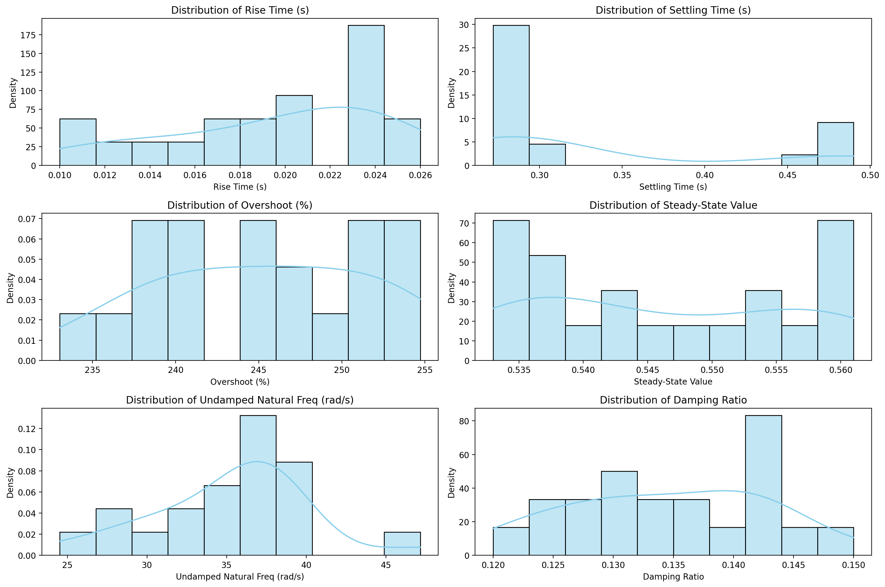

# Motor Response Experiment Documentation

## 1. Experiment Overview

This experiment aims to analyze the response characteristics of a motor system using a step input and evaluate key performance metrics i.e. steady-state behavior, noise filtering, and frequency response.

## 2. Experiment Setup

### Hardware Components

- Motor: 25GA-370 12V 130rpm DC with Encoder Module
- Motor Driver: L298 Dual H-Bridge Motor Driver
- Microcontroller: ESP32 WROOM
- Power Supply: 12V/2A
- Sensor: Optical encoder (comes with the motor)

### Software Components

- Control Algorithm: 
    - ROS2 motor kit hardware interface [Hardware interface](https://github.com/KevinKipkorir254/motor-control-kit/tree/main/encoded_dc_motor_kit_hardware_interface)
    - ROS2 node proportional controller [Proportional controller](https://github.com/KevinKipkorir254/motor-control-kit/tree/main/encoded_dc_motor_kit_PID)
    - ROS2 node respnse analyser [Stet response](https://github.com/KevinKipkorir254/motor-control-kit/tree/main/encoded_dc_motor_kit_hardware_interface)
- Sampling Frequency: 100 Hz
- Filtering: Second-order filter
- Data Logging: Through a subscriber in the response analyser node then inserted into a csv file, experiment runs for 10 seconds

## 3. Methodology

1. Apply a step input from 2 rad/s to 3 rad/s.
2. Measure the motor's velocity response using the sensor.
3. Apply a second-order filter to reduce noise.
4. Collect data at 100 Hz sampling rate.
5. Plot the response for visualization.

## How to repeat the experiment.

```bash
ros2 launch encoded_dc_motor_kit_description motor_kit_server.launch.py
```

```bash
ros2 run encoded_dc_motor_kit_PID p_controller
```

```bash
ros2 run encoded_dc_motor_kit_response_analyzer step_response_analyzer
```



## 4. Observations & Key Findings

- Rise Time (s).
- Settling Time (s).
- Overshoot (%)
- Steady-State Value.
- Undamped Natural Freq (rad/s)
- Damping Ratio.



## 5. Challenges & Limitations

- Limited Sampling Rate: 100 Hz is too low for precise transient analysis.
- Sensor Noise: Requires filtering, but filtering may impact transient accuracy.

## 6. Future Improvements

- Use a higher-frequency sampling system for transient analysis.

## 7. Conclusion

The experiment provided insights into the motor’s steady-state behavior and filtering effectiveness. However, limitations in sampling rate and motor driver performance affected rise time analysis. Future work will focus on improving hardware and software to obtain more accurate system dynamics.